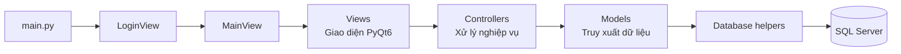

# CarePlus - Hệ thống quản lý khám bệnh

CarePlus là ứng dụng desktop hỗ trợ quản lý hoạt động khám chữa bệnh tại phòng khám. Dự án được xây dựng bằng Python, PyQt6 và kiến trúc MVC, với SQL Server là hệ quản trị cơ sở dữ liệu chính.

## 1. Chức năng chính

| Vai trò | Chức năng tiêu biểu |
| --- | --- |
| Quản trị viên (`admin`) | Quản lý tài khoản, bác sĩ, bệnh nhân, thuốc, dịch vụ, lịch hẹn, thanh toán, báo cáo, phân quyền và sao lưu dữ liệu |
| Bác sĩ (`doctor`) | Xem lịch khám, tiếp nhận ca khám, cập nhật hồ sơ bệnh án, kê đơn thuốc, theo dõi bệnh nhân và thông báo |
| Nhân viên (`staff`) | Tiếp nhận bệnh nhân, quản lý hàng đợi, lịch hẹn, dịch vụ, thanh toán, báo cáo và cài đặt cá nhân |
| Bệnh nhân (`patient`) | Xem bác sĩ, xem dịch vụ, đặt lịch khám, theo dõi lịch sử khám và cập nhật hồ sơ cá nhân |

## 2. Kiến trúc hệ thống

Dự án áp dụng mô hình MVC để tách biệt giao diện, xử lý nghiệp vụ và truy xuất dữ liệu.



```text
datphongkham.python/
|-- assets/                     # Tài nguyên giao diện
|-- controllers/                # Xử lý nghiệp vụ
|-- database/
|   |-- scripts/
|   |   `-- sqlserver/          # Script dành cho SQL Server
|   |-- db.py                   # Kết nối database
|   |-- sql_utils.py            # Helper truy vấn đa hệ quản trị
|   `-- view_db_helper.py       # Helper truy vấn an toàn cho giao diện
|-- models/                     # Mô hình dữ liệu
|-- views/                      # Giao diện theo vai trò
|-- .env.example                # Mẫu cấu hình môi trường
|-- config.py                   # Cấu hình ứng dụng
|-- main.py                     # Điểm bắt đầu chương trình
`-- requirements.txt            # Thư viện Python cần cài đặt
```

## 3. Công nghệ sử dụng

| Thành phần | Công nghệ |
| --- | --- |
| Ngôn ngữ | Python 3.14+ |
| Giao diện desktop | PyQt6 |
| Database chính | SQL Server, `pyodbc` |
| Cấu hình môi trường | `python-dotenv` |

## 4. Cài đặt và chạy chương trình

### 4.1. Yêu cầu hệ thống

- Python 3.14 trở lên
- SQL Server
- ODBC Driver 17 for SQL Server
- Git

### 4.2. Cài đặt thư viện

Tại thư mục gốc của repo:

```powershell
python -m venv .venv
.\.venv\Scripts\Activate.ps1
pip install -r requirements.txt
```

### 4.3. Cấu hình SQL Server

Tạo file `.env` từ file mẫu:

```powershell
Copy-Item .env.example .env
```

Nội dung cấu hình mặc định:

```env
DB_TYPE=sqlserver
DB_SERVER=localhost
DB_NAME=khambenh
DB_TRUSTED_CONNECTION=yes
```

File `.env` chỉ dùng trên máy cá nhân và không được đưa lên GitHub.

### 4.4. Chuẩn bị dữ liệu

Các script SQL Server nằm tại:

```text
database/scripts/sqlserver/
```

Thứ tự sử dụng:

1. Tạo database `khambenh` và các bảng nghiệp vụ cơ bản trên SQL Server.
2. Chạy `sqlserver_notifications.sql` để bổ sung bảng cấu hình người dùng và thông báo.
3. Chạy `seed_sqlserver.sql` khi cần nạp lại dữ liệu mẫu.

> Lưu ý: `seed_sqlserver.sql` xóa dữ liệu nghiệp vụ hiện có trước khi thêm dữ liệu demo. Chỉ chạy script này khi chủ động đặt lại dữ liệu.

### 4.5. Khởi động ứng dụng

```powershell
python main.py
```

## 5. Tài khoản demo

Sau khi nạp dữ liệu mẫu, có thể đăng nhập bằng các tài khoản sau. Mật khẩu mặc định dùng chung là `123456`.

| Vai trò | Tên đăng nhập |
| --- | --- |
| Quản trị viên | `admin` |
| Bác sĩ | `doctor1` |
| Nhân viên | `staff1` |
| Bệnh nhân | `kien.truong` |

Các tài khoản trên chỉ phục vụ mục đích trình diễn và kiểm thử.

## 6. Phân công nhóm

| Thành viên | Vai trò | Phạm vi phụ trách |
| --- | --- | --- |
| Chu Ngọc Linh | Nhóm trưởng | Kiến trúc hệ thống, cấu hình, database, đăng nhập, phân quyền, điều hướng, quản trị, nghiệp vụ nhân viên, tích hợp và kiểm thử tổng thể |
| Đinh Văn Dương | Thành viên | Module bác sĩ: khám bệnh, hồ sơ bệnh án và kê đơn thuốc |
| Bùi Đức Lâm | Thành viên | Module bệnh nhân: bác sĩ, dịch vụ, đặt lịch, lịch sử khám, hồ sơ cá nhân và thông báo |

## 7. Nguyên tắc bảo mật

- Không commit file `.env`, `.ENV`, mật khẩu cá nhân hoặc thông tin kết nối nội bộ.
- Không sử dụng tài khoản demo trong môi trường thật.
- Chỉ chạy script seed khi đã xác nhận có thể đặt lại dữ liệu.
